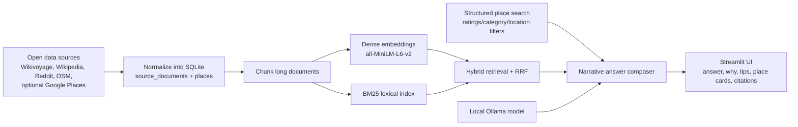

# LocalLens

A local-first RAG assistant for travelers and recent movers. Ask questions like:

- `What should I know before moving to Seattle?`
- `Where is a good sunset spot in San Francisco?`
- `Best taco place in San Jose over 4.5?`
- `Can I rely on public transit in Chicago?`

LocalLens combines open travel guides, local forum threads, structured place records, and optional Google Places enrichment to answer questions with cited, narrative responses.

---

## Architecture



---

## Data Sources

**Default open-source pipeline:**

- `Wikivoyage` — sectioned city/park guide content for activities, transit, food, safety, lodging
- `Wikipedia` — summaries and thumbnail images for orientation and visual context
- `Reddit` — city-subreddit travel/local threads with top comments
- `OpenStreetMap / Overpass` — structured places for restaurants, parks, museums, attractions, hotels, viewpoints, and transit nodes

**Optional enrichment:**

- `Google Places API` — live ratings, review counts, and place metadata
- `NPS API` — national-park metadata

---

## Project Layout

```text
LocalLens/
├── app.py
├── artifacts/
├── data/
│   ├── processed/
│   └── raw/
├── docs/
├── scripts/
├── src/locallens/
├── .env.example
├── Dockerfile
├── docker-compose.yml
└── requirements.txt
```

---

## Quickstart

### 1. Install

```bash
cd LocalLens
python3 -m venv .venv
source .venv/bin/activate
python3 -m pip install --upgrade pip
python3 -m pip install -r requirements.txt
```

### 2. Configure environment

```bash
cp .env.example .env
```

The `.env.example` file includes all required values — no API keys needed to get started.

### 3. Run the app

```bash
PYTHONPATH=src streamlit run app.py
```

The database and embeddings are already included in the repo. No rebuild needed.

---

## Local Model Setup

LocalLens uses a local generation model served through Ollama.

```bash
ollama pull llama3.1:8b-instruct-q4_K_M
ollama serve
```

Retrieval embeddings and reranking run locally via:

- `sentence-transformers/all-MiniLM-L6-v2`
- `cross-encoder/ms-marco-MiniLM-L-6-v2`

---

## Docker

```bash
# Build
docker build -t locallens .

# Run
docker run --rm -p 8501:8501 \
  -e OLLAMA_BASE_URL=http://host.docker.internal:11434 \
  locallens

# Or with Compose
docker compose up --build
```

---

## Deployment

LocalLens is deployed on a GCP Compute Engine VM with Ollama running on the same instance.

---

## Google Places Support

LocalLens integrates with the Google Places API to enable rating-aware search (e.g. `best taco place in San Jose over 4.5 stars`).

---

## Project Files

| Path | Description |
|------|-------------|
| `data/processed/locallens.db` | Main SQLite database |
| `artifacts/chunk_embeddings.npy` | Dense embedding index |
| `src/locallens/ingestion/` | All ingestion code |

---

## Documentation

- [Project writeup](docs/PROJECT_WRITEUP.tex)
- [Demo script](docs/demo_script.md)
- [GCP setup notes](docs/gcp_free_tier.md)
